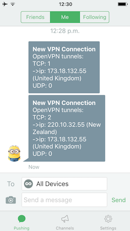

# OpenWrtScripts
General Scripts I use in OpenWRT broken into 3 groups



## 1. Push
This is a simple script, which currently supports sending messages to the following services:

* PushBullet
* Cisco Spark

### Install
```
opkg update
opkg install curl ca-certificates
wget -O /etc/config/push http://rawgit.com/fbradyirl/OpenWrtScripts/master/push/push.conf
wget -O /usr/bin/push.sh http://rawgit.com/fbradyirl/OpenWrtScripts/master/push/push.sh
chmod +x /usr/bin/push.sh
```
### Usage
Now, just fill in required fields in /etc/config/push and test by running the command
```
# First param is the subject, second is the message.
push.sh "Hello" "This is my message"
```

## 2. OpenVPN status watcher
This will keep an eye on OpenVPN status files for any changes.
If any change is detected (e.g. a new connection), it will
parse the IPs of all connections, and figure out which
country the IP comes from, and notify push.sh services.

### Install
```
opkg update
opkg install ca-certificates

wget -O /usr/bin/status_watcher.sh http://rawgit.com/fbradyirl/OpenWrtScripts/master/openvpn-watcher/status_watcher.sh
wget -O /usr/bin/openvpn-status.sh http://rawgit.com/fbradyirl/OpenWrtScripts/master/openvpn-watcher/openvpn-status.sh

chmod +x /usr/bin/status_watcher.sh
chmod +x /usr/bin/openvpn-status.sh

# Add to the top of startup script
sed -i '1istatus_watcher.sh &' /etc/rc.local
```
### Usage
You will need to ensure your OpenVPN server is set to log to a status file. E.g. in /etc/config/openvpn ensure that you have an 'option status' line for each VPN instance:
```
config openvpn 'TCPVPNserver'
    ...
    option status '/tmp/openvpn-status-tcp.log'

config openvpn 'UDPVPNserver'
    ...
    option status '/tmp/openvpn-status-udp.log'
```
Then, you will need to add the names of each server to the top of /usr/bin/openvpn-status.sh
```
# Fill the following in to match the names in your OpenVPN config
STATUS_TCP="$(uci get openvpn.TCPVPNserver.status)"
STATUS_UDP="$(uci get openvpn.UDPVPNserver.status)"
```
Now, reboot your router and the status_watcher.sh will check for changes every minute and notify you when changes are seen.

## 3. SMS Forwarder
If you happen to use OpenWRT with a 3G/4G dongle, and use the ROOter addons from http://ofmodemsandmen.com , I wrote a simple script to forward any incoming SMS texts to the sim card to the push services.

### Install
```
opkg update
opkg install ca-certificates

wget -O /usr/lib/sms/forwardsms.sh http://rawgit.com/fbradyirl/OpenWrtScripts/master/sms/forwardsms.sh
chmod +x /usr/lib/sms/forwardsms.sh
```
To add a hook into incoming message event, you must do the following:
```
# Now, as of ROOter GoldenOrb release (1/Apr/2016)
# you must insert the following lines between
# "uci commit modem" and "fi" of the loop
# in file /usr/lib/sms/processsms

if [ -e /usr/lib/sms/forwardsms.sh ]; then
    sh /usr/lib/sms/forwardsms.sh $CURRMODEM
fi
```
### Usage
As long as you have Push configured (step 1), you will get notified of new SMS and their content as they arrive!
